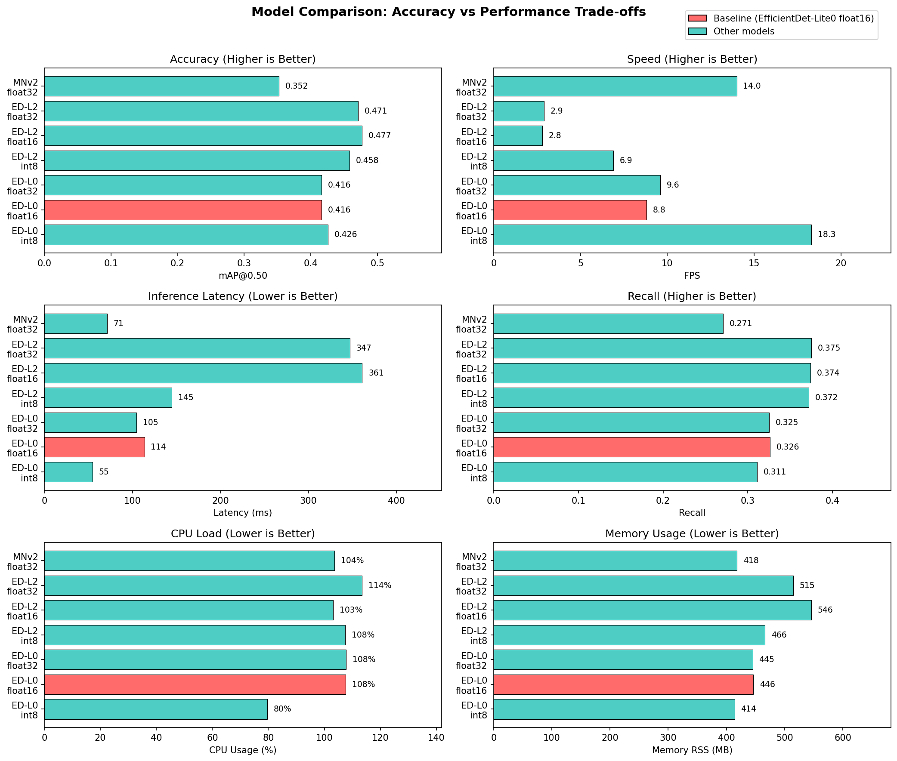

## Object Detection Model Comparison

*Benchmarked on Raspberry Pi 5, 2025-12-05*

### Model Comparison Summary

| Model | Quant | Size (MB) | Input | mAP@0.50 | mAP@0.50:0.95 | Latency (ms) | Det Hz | CPU % | Memory (MB) |
|-------|-------|-----------|-------|----------|---------------|--------------|--------|-------|-------------|
| EfficientDet-Lite0 | int8 | 4.4 | 320×320 | 0.426 | 0.302 | 54.6 (p95: 57.4) | 18.3 | 79.6 | 414 |
| **EfficientDet-Lite0** | **float16** | **6.9** | **320×320** | **0.416** | **0.314** | **113.7 (p95: 120.7)** | **8.8** | **107.6** | **446** |
| EfficientDet-Lite0 | float32 | 13.2 | 320×320 | 0.416 | 0.314 | 104.7 (p95: 111.5) | 9.6 | 107.8 | 445 |
| EfficientDet-Lite2 | int8 | 7.2 | 448×448 | 0.458 | 0.344 | 144.8 (p95: 149.2) | 6.9 | 107.5 | 466 |
| EfficientDet-Lite2 | float16 | 11.6 | 448×448 | 0.477 | 0.364 | 361.0 (p95: 371.5) | 2.8 | 103.2 | 546 |
| EfficientDet-Lite2 | float32 | 22.0 | 448×448 | 0.471 | 0.359 | 347.1 (p95: 361.1) | 2.9 | 113.5 | 515 |
| SSD MobileNetV2 | float32 | 10.8 | 256×256 | 0.352 | 0.244 | 71.4 (p95: 76.9) | 14.0 | 103.6 | 418 |

*Baseline model (EfficientDet-Lite0 float16) in bold. Latency shows mean with p95 in parentheses.*

### Raspberry Pi 5 Recommendation

**Recommended: EfficientDet-Lite0 float16** for GestureBot deployment.

| Model | Accuracy | Speed | CPU | Why/Why Not |
|-------|----------|-------|-----|-------------|
| **EfficientDet-Lite0 float16** | mAP=0.416 | 8.8 Hz | 108% | ✅ Best balance for person following |
| EfficientDet-Lite0 int8 | mAP=0.426 | 18.3 Hz | 80% | Alternative if CPU headroom needed |
| EfficientDet-Lite2 int8 | mAP=0.458 | 6.9 Hz | 108% | Consider if accuracy is critical |

**Trade-off Analysis:**

- **EfficientDet-Lite0 int8 vs float16**: int8 provides +108% detection rate with +2.4% accuracy change. Choose int8 if running additional ROS nodes that need CPU headroom.

- **EfficientDet-Lite2 vs Lite0**: Lite2 int8 offers +10.1% mAP change at cost of -22% detection rate and -0% CPU increase. Consider if detection accuracy is more important than frame rate.
